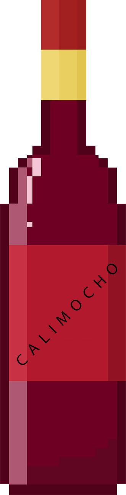

**GDD de BOHEMIAN DRUNK :)**

Videojuego 2D de scroll lateral en el que tienes que correr de izquierda
a la derecha

sin que te pillen los guardias esquivando los distintos obstáculos.

**1. Historia**

El videojuego está inspirado en un personaje del libro "Luces de
Bohemia" de

Valle-Inclán llamado Máximo Estrella. (Específicamente, la escena
cuarta)

En dicha escena, el personaje es arrestado, pero en el juego el jugador
intentará

escapar de los centinelas/policía. Sin embargo, al haber consumido mucho
alcohol,

los movimientos del jugador son caóticos. El objetivo del juego es
llegar a la casa o

conseguir llegar lo más lejos posible.

**2. Mecánicas**

● Salto

○ El jugador tiene la capacidad de saltar obstáculos (y correr por
encima

de ellos)

● Agacharse

○ El jugador tiene la capacidad de agacharse (o dicho de otra forma,

reducir su tamaño para pasar por sitios estrechos)

● Barra alcoholismo

○ Dependiendo del porcentaje de alcoholismo, la cantidad de delay entre

que el jugador pulsa X botón hasta que realiza la acción

correspondiente varía.

○ Si el jugador alcanza el 100% de la barra alcohólica, morirá por un

coma etílico y perderá la partida.

○ La velocidad del jugador depende de esta barra. Su velocidad BASE

se multiplica por la cantidad de alcohol que tenga encima. Aumentar la

velocidad, supone aumentar tu alcoholismo y reducir la velocidad,

supone reducir dicha barra.

○ Algunos power-ups/Items, pueden afectar a esta barra.

● Puntuación

○ Cuanto más distancia hayas recorrido, más puntos obtendrás

○ Además, las monedas y los power-ups te darán puntos extra.

○ Esta puntuación es especialmente importante en el modo de juego

infinito.

**3. Dinámicas**

El juego pretende hacer sentir al jugador la pérdida de control al
manejar un

personaje borracho.

Jugar de una manera rápida aumentará tu nivel de alcoholismo, lo que
tendrá como

consecuencia mayor delay en las acciones (y ver más borroso?).

Por otro lado, jugar de forma lenta, hará que cualquier mínimo error en
la carrera, te

pillen los guardias.

**4. Generación de niveles**

La generación de niveles estará hecha por bloques. Tendremos partes de
niveles ya

creados y a la hora de jugar el nivel se irán generando esas partes con
orden

aleatorio.

Dispondremos de dos modos de juego:

**● Modo Resaca (historia):** se generarán X bloques de nivel y tras
estos se

llegará a casa. Se habrá ganado la partida.

**● Modo infinito**: se generarán bloques de nivel de manera infinita.
El objetivo

es sobrevivir lo máximo posible consiguiendo la mayor cantidad de
puntos.

Como extra, en este modo infinito, la velocidad del jugador será cada
vez

mayor, teniendo así más dificultad sobrevivir más tiempo.

En todo el recorrido, hay 4 niveles de altura:

● Cielo (Solo accesible con el champán)

● Tejado(???): Si te subes a diferentes obstáculos cada vez más altos,
puedes

acabar decidiendo subirte a tejados. Esto es opcional, puedes ir por el
suelo

o por el/los tejados.

● Suelo (Nivel de altura "normal").

● Metro (Solo accesible por entradas al metro en el suelo)

**5. Obstáculos**

Cada obstáculo tiene su propia resistencia, y si el jugador choca con un
obstáculo,

la cantidad de distancia que pierde con los guardias se calcula en base
a la

resistencia del obstáculo (Representado con \[+\]).

● Jarrón que cae del cielo (+)

● Botella vacia (+)

● Cajas(++)

● Barriles (de cerveza, como no) rodando por la calle (++)

● Vallas con agujeros por debajo (++)

● Meterse en casas por la ventana (hay que saltar) o por la puerta. Al
jugador

se le vería a través de las ventanas. (+++)

● Vehículos (Camiones, coches) (++++)

\-\-\-\-\-\-\-\-\-\-\-\-\-\-\-\-\-\-\-\-\-\-\-\-\-\-\-\-\-\-\--Nivel de
abajo\-\-\-\-\-\-\-\-\-\-\-\-\-\-\-\-\-\--

● Botella vacia (+)

● Túneles (++)

● Trenes (Solo en el metro, te obligan a subir arriba)(++++)

**6. POWER-UPS / ITEMS**

● Cerveza → Aumenta tu % de alcoholismo.

● Agua → Reduce tu % de alcoholismo.

● Champán → Accedes a una zona restringida del mapa (llena de monedas)

● Jagger → Insta kill (Alcanzas el coma etílico en el acto)

● Calimocho → Te pone tan ciego, que no ves la barra de alcohol.

● Vodka → Da al jugador un boost de velocidad temporal y le da
invencibilidad

parcial (Solo contra ciertos obstáculos \[No aplicable con vehículos por

ejemplo\]) durante un tiempo limitado sin necesidad de aumentar su barra

alcohólica.

● Monedas → Dan puntos.

**7. Referencias**

\- Geometry Dash

\- Subway Surfers

\- Super Mario Run

https://www.pivotaltracker.com/n/projects/2470810
