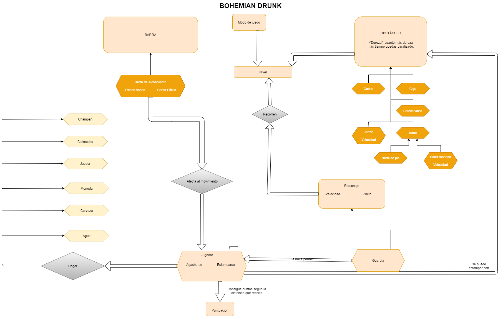

|INTEGRANTES DEL EQUIPO|
|----------------------|
|Alfonso Rodulfo| 
|David Brey|
|Álvaro Cuerva|
|Pablo González|

|ENLACES DE INTERÉS|
|------------------|
|[**PÁGINA DEL JUEGO**](https://dbrey.github.io/Proyecto-PVLI/)|
|[**ENLACE A PIVOTAL TRACKER**](https://www.pivotaltracker.com/n/projects/2470810)|

|**GÉNERO**|**Modo**|
|:------:|:--------:|
|Runner, Scrool Lateral|Solitario|
|**PLATAFORMA**|**PÚBLICO**|
|PC|Mayores de 16 años|

"Bohemian Drunk" es un runner plataformas 2D en scroll lateral en el que encarnamos a Max Estrella en su huida del Capitán Pitito.
En dicha huida, el ebrio Max debe mantener vigilado su nivel de borrachera mientras sortea obstáculos en el Madrid de los años 20 y bebe distintos brebajes que afectan a dicha borrachera y a como él ve el mundo, mientras nota como su borrachera afecta a la agilidad con la que se mueve.

### Basado en Luces de Bohemia:

* ### Personajes:
Máximo Estrella: Un escritor ciego con poco éxito en su carrera y por ende su familia está sumida en la pobreza. Durante gran parte de la obra está notablemente borracho.

 Capitán Pitito: Capitán de un cuerpo de las autoridades, quien arresta (en la obra) a Máximo Estrella.

* ### Escena del libro en la que sucede Bohemian Drunk:

Máximo Estrella, harto de que su libro no consiga las ventas que él cree que merece, se va con su amigo Don Latino a beber a un bar cercano. Al salir, ambos están muy borrachos y se encuentran con las autoridades, lideradas por el Capitán Pitito. Este, al verlos tan borrachos, se decepciona y arresta a Máximo por faltarle el respeto.

* **Salto:**
El jugador tiene la capacidad de saltar encima de obstáculos (y correr por encima de ellos).

* **Agacharse:**
El jugador tiene la capacidad de agacharse y evitar ciertos objetos consumibles.

* **Barra de alcoholismo:**
Barra que representa el estado de ebriedad del personaje jugable, cuanto más borracho más llena estará y viceversa. Esta barra representa 150 puntos de ebriedad.
El estado de ebriedad puede aumentar o disminuir en función de distintos factores:
1.La velocidad a la que el jugador corre lo hace aumentar o disminuir  en función de si acelera o desacelera respectivamente.

2.Distintos objetos consumibles que se encuentran esparcidos a lo largo de mapa.

El porcentaje de complecion de la barra establece el delay que habrá desde que el jugador realiza un input y la respuesta de Max, ya sea acelerar, desacelerar agacharse o saltar.
Además de estos factores, llenar por completo la barra , significa que se cae en coma etílico y la partida termina.

* **Obstáculos:**
A lo largo del juego, el jugador se encuentra con distintos obstáculos en movimiento o estáticos. En caso de chocarse con alguno de ellos la velocidad del jugador se verá reducida bruscamente en menor o mayor medida, en algunos casos llevándote incluso a perder la partida instantáneamente en caso de chocar.

* **Power ups:** Esparcidos por el mapa, se encuentran objetos consumibles o power-ups que varían la experiencia de juego.
Algunos afectarán directamente a tu estado de ebriedad, otros te daran la habilidad de volar libremente haciendo más fácil avanzar y otros causarán que partes del HUD desaparezcan por cierto tiempo.

* **Puntuación:** Cuanto más tiempo se logre escapar de la policía y no caer en coma etílico, más puntuación obtiene el jugador. Además, esparcidas por el mapa se encuentran monedas que, en caso de ser recogidas, otorgan puntuación extra.

El juego pretende hacer sentir al jugador la pérdida de control al manejar a un
personaje borracho. Aumentar la velocidad permitirá al jugador alejarse del guardia que le persigue pero esto se traducirá en  un aumento del nivel de borrachera con todo lo que ello conlleva, por otro lado jugar de manera lenta, no aumentara dicha borrachera pero si que hará que sea mas facil ser capturado por el guardia al mínimo fallo.

Bohemian Drunk cuenta con una estetica pixelada 2d, con unos escenarios coloridos y una música desenfadada. El arte cuenta con una paleta de colores vivos y alegres, acordes al carácter arcade del juego.
Tiles de la ciudad creados por Guardian
Animacion del menu creade por 
Pixel Art de la ciudad de fondo creado por Joseth
Font usada en el juego proveniente de Carrier Command
Musica del menu creada por Axel del Grey(“Desvelado 8 Bit)
Musica del juego  creada por 
Resto del arte creada por Cerves Games.

* **Nivel:**
El juego consta de un bloque que se repetirá de forma infinita hasta que el jugador pierda. Cada vez que el jugador llegue al final de este bloque, la velocidad general del mapa aumentará un poco poniendo más diícil el aumento de la puntuación y la supervivencia del jugador.

En todo el recorrido, podemos encontrar tres niveles por los que transitar:

○ Cielo accesible con el objeto consumible "champán" en el que se ofrecerá una zona segura en la que conseguir puntos y monedas con facilidad.

○ Plataformas de edificios: Ya sea en el tejado o por terrazas el jugador podrá moverse a distintas alturas.

○ Suelo (Nivel de altura “normal”), el cuál cuenta con un relieve para evitar así que sea un nivel plano.

* **Obstáculos:**

○ Estáticos:
El objetivo del jugador será esquivarlos. Cada uno de estos ralentiza/penaliza al jugador en función de una resistencia establecida. No se mueven.

|**Nombre**|**Sprite**|**Resistencia**|**Descripción**|
|:----------:|:----------:|:---------------:|:---------------:|
|Botella Vacía||100|Es una botella y se encuentra de forma uniforme por todas las zona del mapa.|
|Caja||200|Cubo que representa una caja y que se encuentra principalmente en el suelo.|
|Barril||200|Barrica de cerveza que suele encontrarse en las terrazas.|

○ Físicos:
Tienen el mismo efecto que los obstáculos estáticos pero estos se mueven.

|**Nombre**|**Sprite**|**Resistencia**|**Descripción**|
|:----------:|:----------:|:---------------:|:---------------:|
|Jarrón||100|Cae de las ventanas y se rompe al chocar con el suelo, para que spawnee el jugador tiene que estar cierta altura por debajo de la ventana.|
|Barril rodando||400|Spawnea cuando tiene al jugador a cierta distancia y viene por delante del jugador.|
|Coche verde||Te mata al colisionar|Spawnea cuando tiene al jugador a cierta distancia y viene por delante del jugador.|
|Coche negro||Te mata al colisionar|Spawnea cuando tiene al jugador a cierta distancia y viene por delante del jugador.|Spawnea cuando tiene al jugador a cierta distancia y viene por detrás del jugador.|

* **Power-ups:** Aplican un efecto al ser cogido, ya sea bueno o malo.

|**Nombre**|**Sprite**|**Efecto**|
|:----------:|:----------:|:---------------:|
|Cerveza||Aumenta en 15 puntos tu nivel de ebriedad.|
|Agua||Disminuye en 60 puntos tu nivel de ebriedad.|
|Champán||Permite al jugador subir encima de la botella aumentando la velocidad con la que se mueve y avanzar con facilidad en el nivel. Además permite conseguir gran cantidad de monedas que aparecen solo cuando se consume este power up|
|Jägger||Aumenta al máximo tu nivel de ebriedad, haciéndote perder la partida.|
|Calimocho||Oculta temporalmente la barra de alcohol.|
|Monedas||Aumenta en 100 puntos tu puntuación actual.|

**Menú inicial:**

**Interfaz in-game:**

**Plataforma de gestión:**

Pivotal Tracker es una herramienta de cordinación de proyectos que permite establecer historias de usuario de manera ordenada para que cada uno de los miembros de un proyecto puedan, de manera sencilla, asignarse historias y tanto su dificultad como su compleción quede registrada día a día.

**Plataformas de comunicación:**

Discord es una plataforma de comunicación vía voz, que hemos usado para reuniones de voz.
Telegram es una plataforma de mensajería de texto usada para la coordinación día a día.

- Luces de Bohemia
- Geometry Dash
- Subway Surfers
- Super Mario Run

|Alfonso Rodulfo 27%|
|-------------------|
|**Pablo González 26%**|
|**Álvaro Cuerva 24%**|
|**David Brey 23%**|